# 2025年排名前18的国际汇款平台汇总(最新整理)

每次需要国际汇款，看到银行那高昂的手续费和不太理想的汇率，是不是感觉心都在滴血？其实现在有很多专业的在线国际汇款平台，不仅操作方便，还能帮你省下一大笔钱。这篇文章就帮你整理了市面上最好用的一些平台，让你轻松实现低手续费跨境转账，告别信息不透明的烦恼。

## **[CurrencyFair](https://currencyfair.com)**

独特的P2P换汇，汇率可能优于市场价。

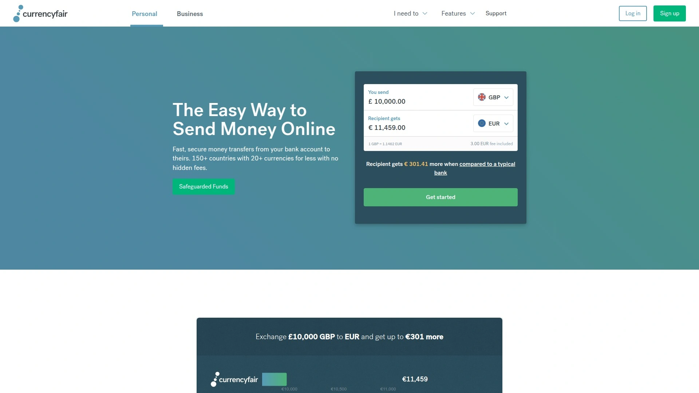

CurrencyFair最酷的地方在于它的点对点（Peer-to-Peer）市场。简单来说，你可以直接和其他需要换汇的用户进行匹配交易。比如，你想用美元换欧元，平台会帮你找到一个想用欧元换美元的人。这种模式下，你有可能获得比市场中间价还要好的汇率。当然，如果没有人匹配，它也会提供一个极具竞争力的常规汇率。这种模式非常适合那些对汇率敏感、不急于一时半刻完成交易的用户。

**核心特点:**
* **点对点市场:** 有机会获得超优汇率。
* **费用透明:** 手续费清晰明了，没有隐藏费用。
* **固定费用低:** 对于小额汇款来说，费用结构非常友好。

## **[Wise](https://www.wise.com/)**

透明的中间价汇率，综合体验的王者。

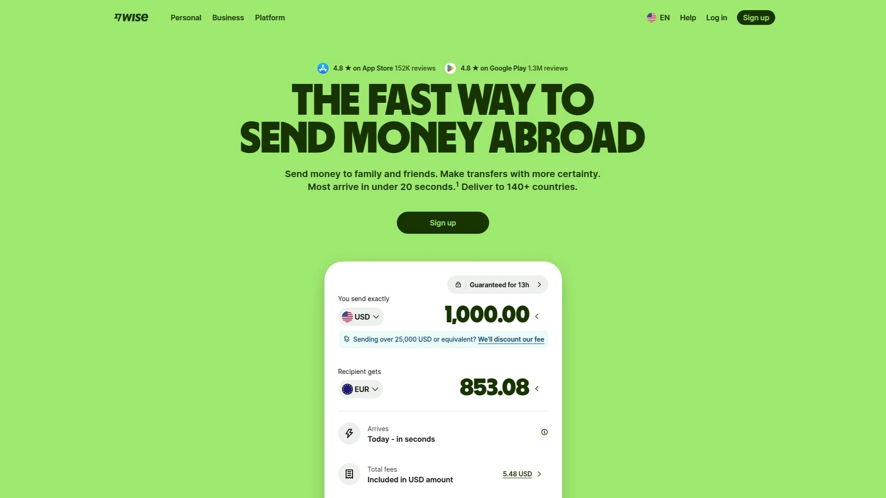

Wise（以前叫TransferWise）几乎是国际汇款的代名词了。它最大的卖点就是坚持使用“市场中间价”，也就是你在Google上搜到的那个汇率，然后只收取一笔公开透明的、非常低的手续费。它还提供一个多币种账户，让你能像本地人一样持有和管理超过50种货币，对于自由职业者、留学生和数字游民来说简直是神器。

## **[Remitly](https://www.remitly.com/)**

速度灵活可选，适合给家人汇生活费。

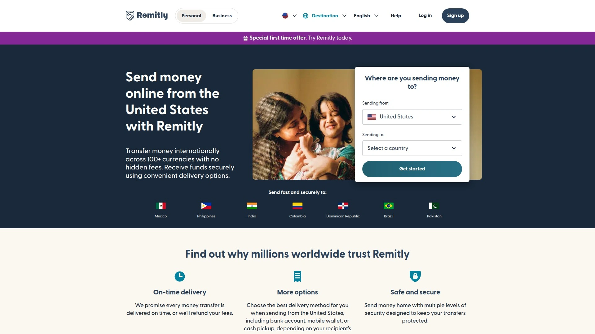

Remitly非常专注于个人对个人的汇款（比如给家里的亲人寄钱）。它的一大特色是提供两种转账速度选项：Express（速快）通常几分钟内就能到账，但费用稍高；Economy（经济）则需要3-5个工作日，但费用更低，汇率也可能更好。这种灵活性让用户可以根据自己的紧急程度来平衡成本和速度。

## **[WorldRemit](https://www.worldremit.com/)**

收款方式多样，覆盖全球的汇款网络。

如果你要汇款的国家或地区，收款人没有银行账户怎么办？WorldRemit就是解决这个问题的专家。除了常规的银行转账，它还支持现金提取、手机钱包充值和话费充值等多种收款方式。它的网络覆盖非常广，尤其是在非洲、亚洲和拉丁美洲的许多国家，提供了极大的便利。

## **[XE Money Transfer](https://www.xe.com/)**

老牌货币专家，大额转账值得信赖。

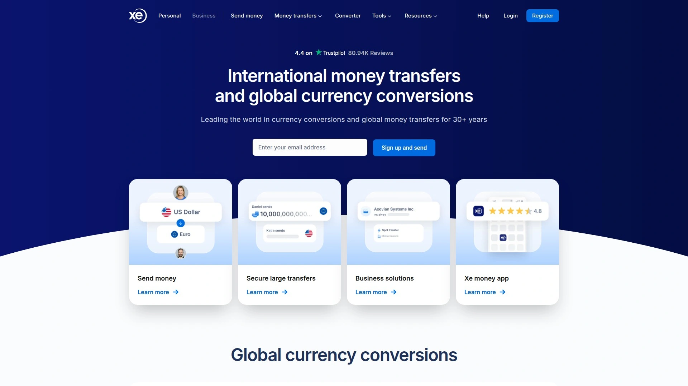

很多人可能都用过XE的汇率查询工具，而它的汇款服务同样可靠。作为一个历史悠久的货币信息提供商，XE在处理大额汇款方面经验丰富，安全性和稳定性都非常有保障。虽然界面可能没有一些新兴平台那么时髦，但对于几十万甚至上百万的大额交易来说，稳妥是第一位的。

## **[OFX](https://www.ofx.com/)**

专属客户经理，适合企业和高净值人群。

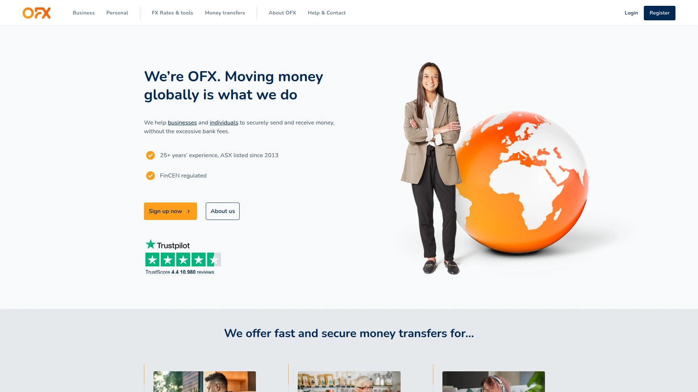

OFX主打的是为企业和高净值个人提供更个性化的服务。它为客户配备专属的客户经理，提供24/7的电话支持，你甚至可以和他们讨论市场走势、锁定未来汇率。如果你需要处理复杂的商业支付或者大额个人投资，OFX提供的专业服务会让你非常安心。

## **[Revolut](https://www.revolut.com/)**

一体化金融App，转账只是功能之一。

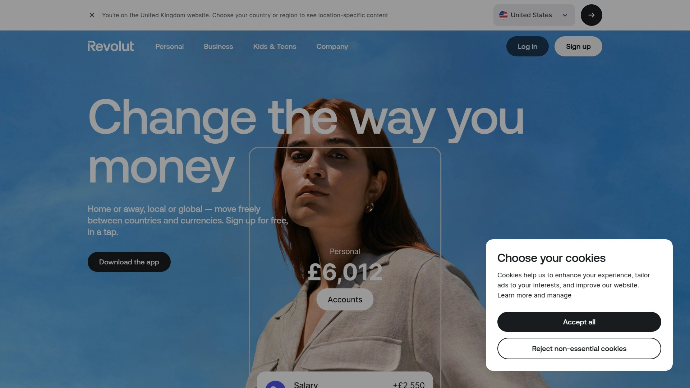

Revolut更像是一个“金融超级应用”，国际汇款只是它众多功能中的一个。除了提供极具竞争力的汇率和低费用转账外，你还可以在同一个App里完成日常消费、投资股票、购买加密货币等操作。它非常适合那些希望在一个平台管理所有金融活动的科技爱好者和年轻用户。

## **[Payoneer](https://www.payoneer.com/)**

专为自由职业者和跨境电商打造。

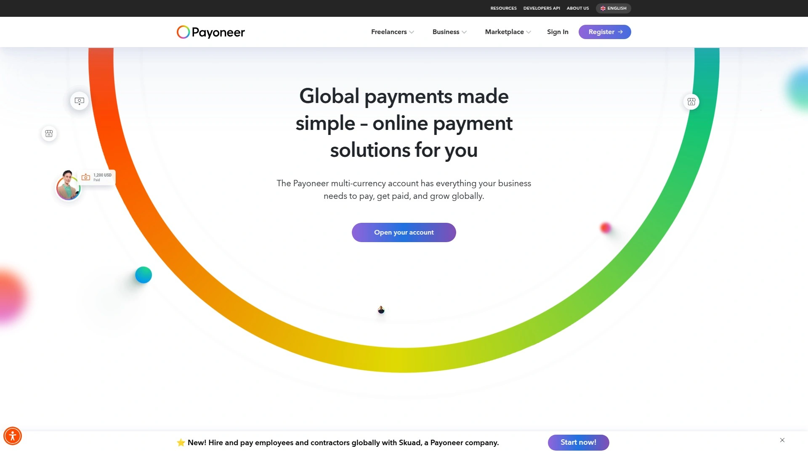

如果你是自由职业者，需要从国外的客户那里收款，或者你是亚马逊、Upwork等平台的卖家，那Payoneer就是为你量身定做的。它让你可以轻松接收来自全球企业和平台的付款，并以较低的成本将资金转入你本地的银行账户。它更侧重于B2C和B2B的收款场景。

## **[Xoom](https://www.xoom.com/)**

PayPal旗下服务，速度快且方便。

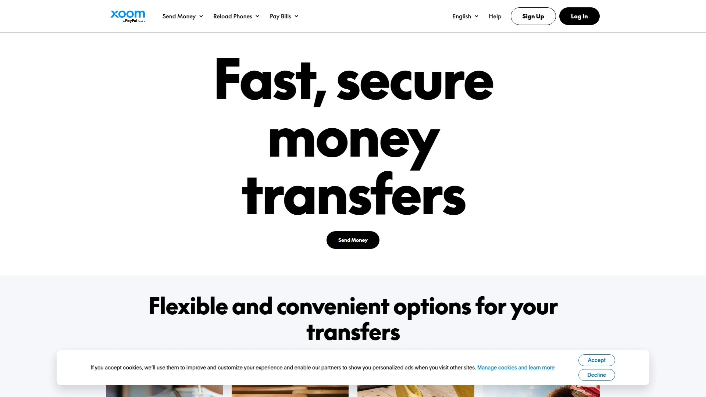

作为PayPal的子公司，Xoom最大的优势就是快。很多转账都可以在几分钟内完成。它同样支持银行存款、现金取款甚至送款上门等多种方式。如果你已经是PayPal的忠实用户，使用Xoom会感觉非常无缝和便捷，信任度也很高。

## **[Skrill](https://www.skrill.com/)**

流行的数字钱包，游戏和交易用户首选。

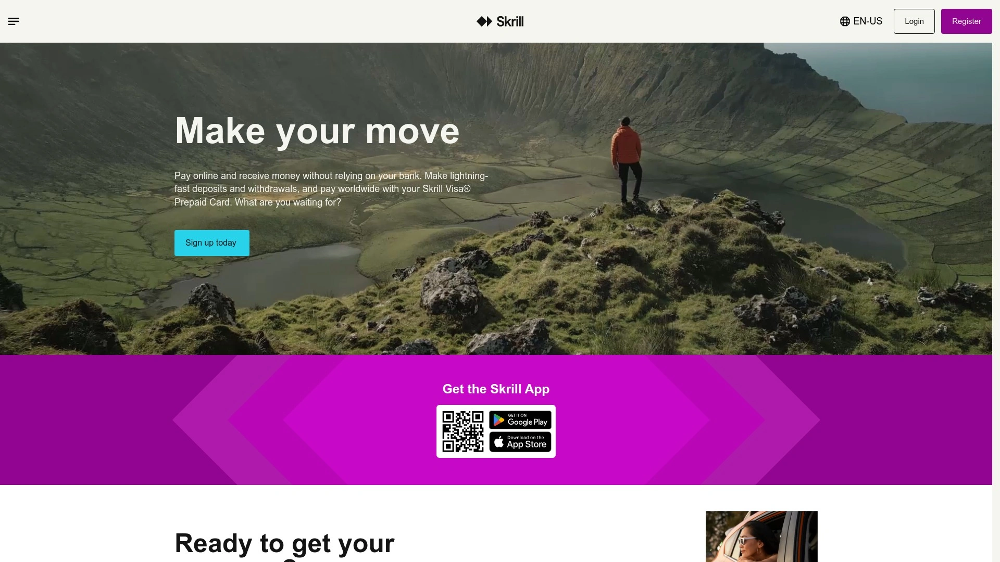

Skrill是一个功能强大的数字钱包，在在线游戏、外汇交易等领域非常流行。用户可以用它来进行快速的国际转账。如果汇款人和收款人都有Skrill账户，转账几乎是即时的。它也支持将资金转入银行账户，对于特定圈层的用户来说非常方便。

## **[Western Union](https://www.westernunion.com/)**

现金为王，拥有无与伦比的实体网络。

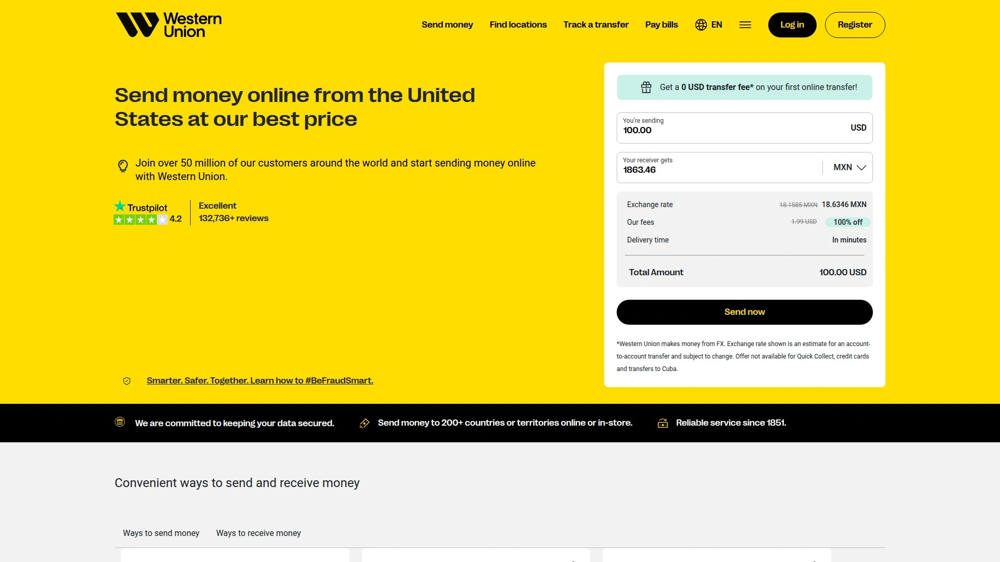

西联汇款是这个领域的“老大哥”。尽管在线平台冲击巨大，但它依然有一个任何平台都无法比拟的优势：遍布全球的数十万个实体代理网点。如果你的收款人急需现金，或者生活在金融服务不那么发达的地区，西联的现金取款服务是无可替代的选择。

## **[MoneyGram](https://www.moneygram.com/)**

现金取款的另一巨头，网络覆盖广泛。

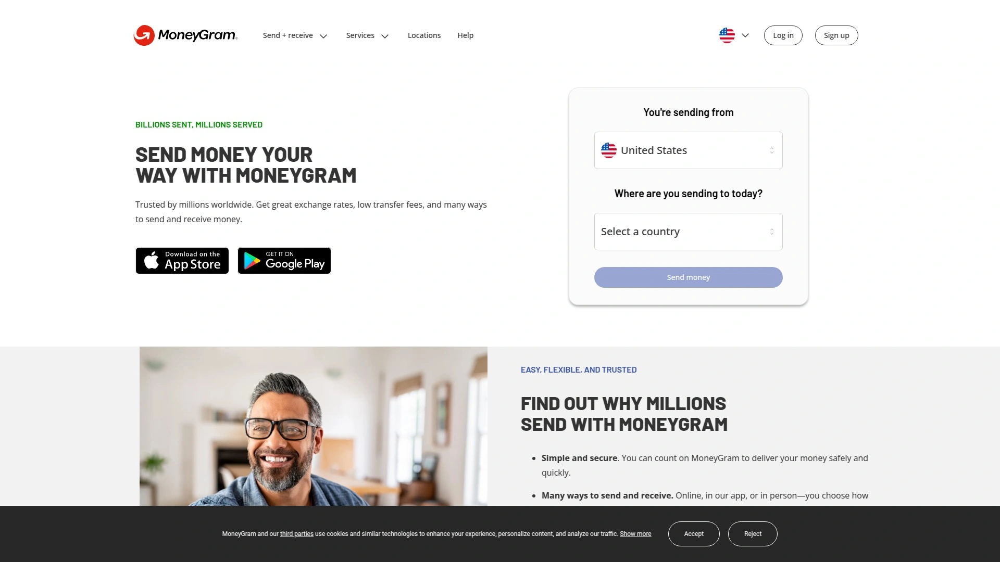

和西联汇款类似，MoneyGram也拥有庞大的全球现金取款网络。它在一些国家和地区的网点覆盖可能比西联更有优势。在选择时，可以比较一下两家在你目标国家的网点便利性和费用，它们通常是现金汇款场景下的直接竞争对手。

## **[Instarem](https://www.instarem.com/)**

汇率优良，积分系统带来额外优惠。

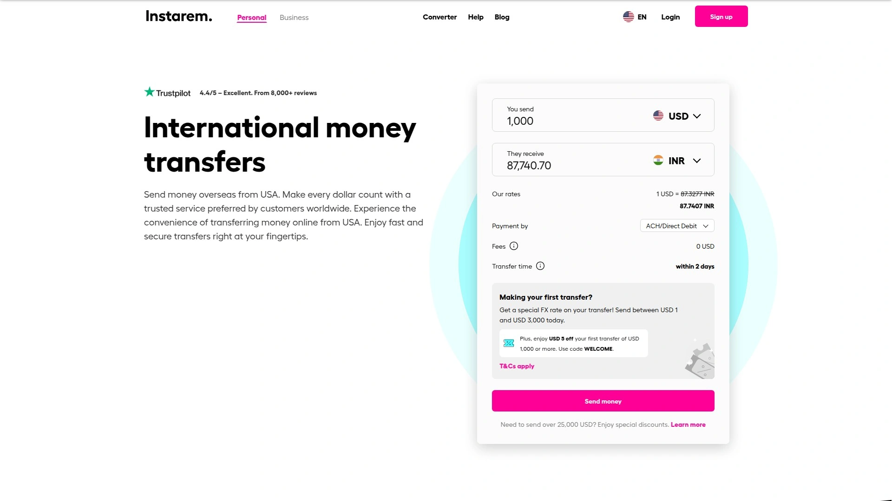

Instarem以其极具竞争力的汇率和透明的低费用而受到好评。它的一个特色是名为“Amaze”的积分系统，你进行的每笔交易都能赚取积分，这些积分可以用来抵扣未来交易的手续费，对于频繁汇款的用户来说，能进一步降低成本。

## **[Panda Remit](https://www.pandaremit.com/)**

专注服务华人，无缝对接国内支付。

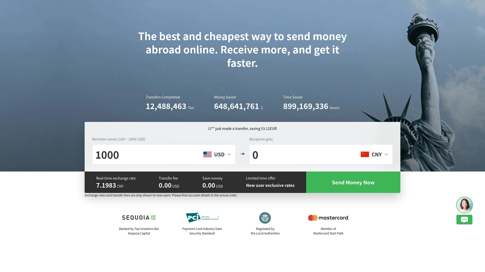

熊猫速汇（Panda Remit）非常明确地将目标用户定为海外华人。它最大的优势是能够非常方便地将外币汇入国内收款人的微信或支付宝账户，整个过程非常符合国内用户的使用习惯。如果你是海外华人，需要给国内的亲友汇款，这是一个极其便捷的选择。

## **[Paysend](https://www.paysend.com/)**

费用固定透明，主打卡对卡转账。

Paysend的模式非常简单直接：无论金额大小，大部分国家之间的转账都只收取一笔固定的、很低的手续费。它主打卡对卡（card-to-card）转账，你只需要知道收款人的银行卡号就能汇款，非常快捷。这种透明的定价模式让用户可以轻松预估总成本。

## **[TorFX](https://www.torfx.com/)**

提供个性化服务的汇款专家。

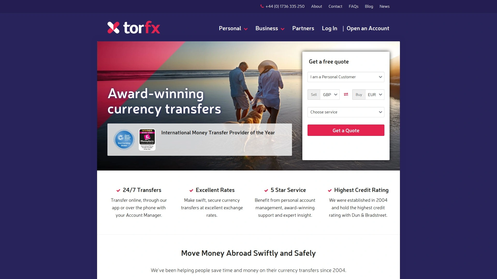

与OFX类似，TorFX也强调个性化服务。它会为你分配一位客户经理，你可以通过电话或邮件与他们沟通你的汇款需求。他们不收取转账手续费，而是将成本包含在汇率差价中。对于不习惯在线操作或需要专业指导的用户来说，这是一个不错的选择。

## **[Azimo](https://www.azimo.com/)**

速度快，在欧洲和非洲网络强大。

Azimo以其快速的转账和广泛的收款网络而闻名，尤其是在欧洲、非洲和南美地区。它同样支持现金取款和手机钱包等多种方式，并且首次转账通常有非常优惠的政策，界面友好，操作简单，很适合移动端用户。

## **[N26](https://www.n26.com/)**

集成在手机银行中的便捷汇款。

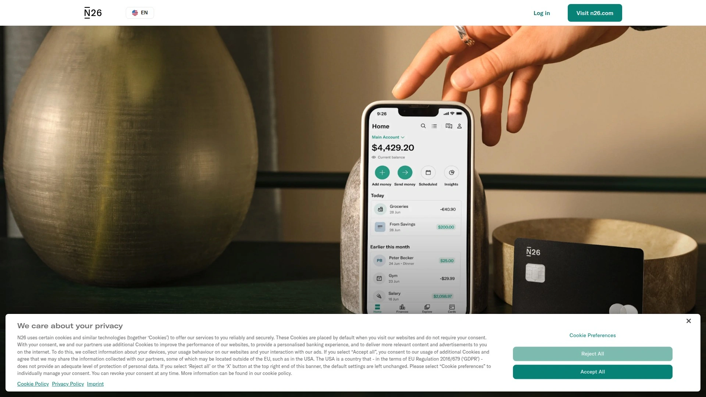

N26是一家德国的数字银行，在欧洲非常受欢迎。它的国际汇款功能直接集成在手机银行App中，通常是与Wise合作提供服务。对于已经是N26银行账户的用户来说，无需再注册其他平台，可以直接在熟悉的银行App内完成汇款，体验非常流畅。

***

### **常见问题 (FAQ)**

**问：如何选择最适合我的国际汇款平台？**
答：主要看三点：你的汇款金额、对速度的要求，以及收款人希望如何收到钱（银行账户还是现金）。大额汇款看重汇率和单笔费用上限，小额汇款更看重固定手续费的多少。

**问：这些在线平台真的比传统银行便宜吗？**
答：绝大多数情况下是的。它们通常提供更接近市场中间价的汇率，手续费也更透明、更低。银行往往会在汇率上增加较多价差，并可能收取多重电报费。

**问：在线汇款安全吗？**
答：本文列出的所有平台都是在各自国家受到严格金融监管的机构，其安全性与主流银行相当。它们采用加密技术和安全协议来保护你的资金和个人信息。

***

### **总结**

总而言之，告别银行高昂的费用，选择一个合适的在线平台能让你的每一分钱都花在刀刃上。在众多选择中，如果你追求极致的汇率，希望通过独特的交易模式找到最佳换汇时机，那么[CurrencyFair](https://currencyfair.com)的点对点市场机制尤其值得一试。
